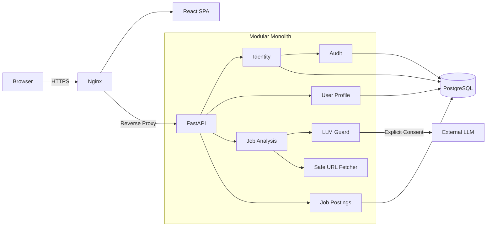

<h1 align="center">JobOps Radar</h1>

<p align="center">
  비정형 채용공고와 이력서를 구조화해<br>
  <strong>지원 근거, 역량 차이와 준비 계획</strong>으로 바꾸는 채용 분석 서비스
</p>

<p align="center">
  <a href="https://jobjobs.shop"><strong>서비스 체험</strong></a>
  ·
  <a href="https://jobjobs.shop/docs"><strong>API 문서</strong></a>
  ·
  <a href="docs/operations/production-deployment.md"><strong>운영 배포</strong></a>
  ·
  <a href="docs/README.md"><strong>전체 문서</strong></a>
</p>

<p align="center">
  
  
  
  
  
  
</p>

---

## 프로젝트 소개

채용공고의 요구사항은 자유 형식 텍스트에 흩어져 있고, 지원자의 경험도 이력서 문장 속에 분산돼 있습니다. JobOps Radar는 두 입력을 검증 가능한 구조로 바꿔 다음 질문에 답합니다.

- 이 공고가 실제로 요구하는 역량은 무엇인가?
- 내 경험 중 어떤 내용이 지원 근거가 되는가?
- 부족한 역량은 무엇이며 무엇부터 준비해야 하는가?

공개 채용공고 URL 또는 직접 입력한 본문을 분석하고, 사용자가 저장한 Markdown 이력서와 비교해 적합도·근거·일치 기술·부족 기술·준비 계획을 반환합니다. 외부 LLM을 사용할 수 없거나 사용자가 전송에 동의하지 않으면 결정론적 분석으로 안전하게 전환합니다.

## 핵심 성과

| 구분 | 결과 |
| --- | --- |
| 운영 배포 | AWS EC2, Nginx, systemd, PostgreSQL, HTTPS 구성 |
| 자동 검증 | `pytest` 103개 통과, Alembic model drift 없음 |
| Query 개선 | 5만 건 기준 10.480ms → 0.148ms |
| 실행 계획 | Seq Scan + Sort → 단일 Index Scan |
| 장애 격리 | DB 장애 시 liveness 200, readiness 503으로 분리 |
| 추적성 | 모든 응답과 구조화 로그에 `X-Request-ID` 연결 |
| TLS | Let's Encrypt 인증서와 자동 갱신 dry-run 검증 |

> Query 개선 수치는 PostgreSQL 18.4, 단일 EC2와 정해진 benchmark 분포에서 측정한 결과입니다. 일반적인 운영 성능 보장이 아니라 index 결정의 재현 가능한 근거로 사용합니다.

## 사용자 흐름

```text
회원가입·로그인
    → Markdown 이력서 저장
    → 채용공고 URL 또는 본문 입력
    → 외부 LLM 전송 동의 선택
    → 요구사항·근거 구조화
    → 적합도·일치/부족 기술·준비 계획 확인
    → 프로필 원문과 구조화 데이터 삭제
```

## 주요 기능

### 1. 인증과 사용자 프로필

- Argon2 비밀번호 해싱과 PyJWT access token
- 계정 존재 여부를 노출하지 않는 동일한 로그인 실패 응답
- 비밀번호 검증 동시성 제한으로 CPU 포화 방어
- Markdown 이력서 원문과 구조화 프로필의 사용자별 격리
- 프로필 조회·교체·삭제
- 가입·로그인 성공·실패 보안 감사 이벤트

### 2. 채용공고 수집과 분석

- 공개 HTTP(S) URL 또는 직접 전달한 HTML·본문 지원
- 사설 IP, loopback, credential 포함 URL을 차단하는 SSRF 방어
- redirect 횟수, 응답 크기와 timeout 제한
- 공고·이력서를 section ID 기반 JSON으로 변환
- LLM evidence ID가 실제 입력에 존재하는지 검증
- 명시적 동의가 있을 때만 외부 LLM으로 데이터 전송
- provider 실패·timeout·schema 오류 시 결정론적 fallback

### 3. 공고 데이터와 트랜잭션

- 공급자 중립적인 `JobPosting`, `JobRequirement` 모델
- `(source, external_id)` unique constraint로 중복 방지
- 회사명·활성 상태 filter, 생성일·마감일 정렬과 페이지네이션
- 공고와 요구사항 묶음을 한 transaction으로 저장
- 중간 flush·constraint 오류 시 전체 rollback과 session 재사용

### 4. 운영 관측성

- process liveness와 DB readiness endpoint 분리
- 외부 또는 서버 생성 `X-Request-ID`
- request ID, method, path, status와 latency를 JSON 로그로 기록
- query string, request body, credential과 내부 예외 원문 비기록
- systemd 재시작 정책과 Nginx reverse proxy

## 기술 스택

| 영역 | 기술 | 선택 이유 |
| --- | --- | --- |
| Backend | Python, FastAPI, Pydantic | 빠른 API 계약 작성과 OpenAPI 기반 검증 |
| Persistence | SQLAlchemy 2.0, Alembic | 명시적 transaction과 재현 가능한 schema 변경 |
| Database | PostgreSQL 18.4 | constraint, transaction과 실제 query plan 검증 |
| Authentication | Argon2, PyJWT | 비밀번호 저장과 작은 내부 access token 범위 분리 |
| Analysis | OpenAI-compatible LLM API | provider 경계와 구조화 응답을 유지한 선택적 분석 |
| Frontend | React, TypeScript, Vite | 단일 사용자 흐름을 검증하는 가벼운 UI |
| Infra | AWS EC2, Nginx, systemd | 현재 규모에서 운영 경로를 직접 관찰 가능한 구성 |
| Security | Let's Encrypt, Certbot | 공개 HTTPS와 자동 인증서 갱신 |
| Test | pytest, FastAPI TestClient | service·route·DB 실패 경로의 자동 회귀 검증 |

## 아키텍처

현재 규모와 단일 개발자 운영 비용을 고려해 마이크로서비스 대신 **모듈러 모놀리스**를 선택했습니다. 하나의 배포 단위를 유지하면서 인증, 감사, 공고, 분석과 외부 연동의 경계를 코드 수준에서 분리했습니다.



```text
Gabia DNS
  → AWS Elastic IP
  → Nginx :80/:443
       ├─ React 정적 파일
       └─ FastAPI 127.0.0.1:8000
             └─ PostgreSQL localhost:5432
```

FastAPI 8000과 PostgreSQL 5432는 외부에 공개하지 않습니다. 자세한 구성은 [시스템 구조](docs/architecture/system-overview.md)와 [운영 배포 현황](docs/operations/production-deployment.md)에 기록했습니다.

## 대표적인 기술적 문제 해결

### PostgreSQL 공고 목록 최적화

감으로 index를 추가하지 않고 실제 service statement와 5만 건의 격리된 데이터를 사용해 `EXPLAIN (ANALYZE, BUFFERS)`를 측정했습니다.

```text
Before: Seq Scan → 47,500행 제거 → top-N heapsort → 10.480ms
After : ix_job_postings_company_active_expiration_id → 0.148ms
```

Filter와 정렬 계약을 기준으로 다음 index를 적용했습니다.

```text
(company_name, is_active, expiration_date ASC, id DESC)
```

그 결과 별도 Sort node가 사라지고 필요한 20행에서 scan을 종료했습니다. 측정 절차와 원본 항목은 [PostgreSQL 실행 계획 실험](docs/experiments/postgresql-query-plan.md)에 있습니다.

### DB 장애와 process 장애 구분

하나의 `/health`가 모든 상태를 대표하면 DB 장애 때 process까지 재시작되는 잘못된 운영 판단이 발생할 수 있습니다.

- `/health/live`: process가 요청에 응답하는지 확인
- `/health/ready`: PostgreSQL `SELECT 1`을 실행해 DB-backed 요청 처리 가능 여부 확인

DB 오류 원문이나 연결 문자열은 HTTP 응답과 warning log에 노출하지 않습니다.

### 외부 LLM의 불확실성 격리

LLM 결과를 그대로 신뢰하지 않고 다음 경계를 적용했습니다.

1. 요청마다 외부 전송 동의 확인
2. section ID만 외부 입력 근거로 전달
3. 존재하지 않는 evidence ID 거부
4. timeout·resource exhaustion·schema 오류를 안정적인 reason code로 분류
5. 실패 시 deterministic 분석으로 fallback
6. 동시 provider 호출 수 제한

## API

| Method | Endpoint | 설명 |
| --- | --- | --- |
| `POST` | `/auth/register` | 회원가입 |
| `POST` | `/auth/login` | access token 발급 |
| `GET` | `/users/me` | 현재 사용자 조회 |
| `PUT` | `/users/me/profile` | Markdown 이력서 저장·교체 |
| `GET` | `/users/me/profile` | 프로필 조회 |
| `DELETE` | `/users/me/profile` | 원문과 구조화 프로필 삭제 |
| `POST` | `/job-analyses` | 이력서와 채용공고 비교 |
| `GET` | `/job-postings` | 공고 filter·정렬·페이지네이션 |
| `GET` | `/health/live` | process liveness |
| `GET` | `/health/ready` | DB readiness |

전체 요청·응답 예시는 [MVP API 사용 가이드](docs/api/mvp-api-guide.md)와 [Swagger UI](https://jobjobs.shop/docs)에서 확인할 수 있습니다.

## 검증

```powershell
python -m pip install -e ".[dev]"
python -m pytest -q -p no:cacheprovider
python -m alembic upgrade head
python -m alembic check
python -m compileall -q app tests alembic
```

테스트는 정상 흐름뿐 아니라 다음 실패 경로를 포함합니다.

- 중복 이메일, 잘못된 인증 정보와 변조·만료 JWT
- 비밀번호·token·raw request의 감사 로그 비저장
- DB 장애 중 readiness 503과 liveness 200
- 잘못된 request ID 교체와 500 응답의 내부 예외 비노출
- transaction 중간 실패의 전체 rollback
- URL fetch의 SSRF·redirect·크기·timeout 제한
- LLM schema·evidence 검증과 deterministic fallback

## 로컬 실행

```powershell
python -m venv .venv
.\.venv\Scripts\Activate.ps1
python -m pip install -e ".[dev]"
Copy-Item .env.example .env
python -m alembic upgrade head
python -m uvicorn app.main:app --reload
```

기본 `.env.example`은 SQLite fallback을 사용합니다. PostgreSQL은 `docker-compose.yml` 또는 별도 server를 사용할 수 있습니다.

- Swagger UI: <http://127.0.0.1:8000/docs>
- Liveness: <http://127.0.0.1:8000/health/live>
- Readiness: <http://127.0.0.1:8000/health/ready>

Frontend는 별도 terminal에서 실행합니다.

```powershell
Set-Location frontend
npm ci
npm run dev
```

실제 API key, JWT secret, DB credential과 SSH key는 commit하지 않습니다.

## 주요 설계 결정과 Trade-off

| 결정 | 선택 | 감수한 한계 |
| --- | --- | --- |
| 서비스 구조 | 모듈러 모놀리스 | 독립 배포와 장애 격리보다 현재 운영 단순성 우선 |
| 공고 입력 | 사용자 URL·본문 | 자동 수집 범위는 작지만 API 승인과 scraping 위험을 회피 |
| 분석 | 검증된 LLM + deterministic fallback | 완전한 생성 자유도보다 재현성과 장애 복구 우선 |
| 인증 | 내부 JWT access token | Refresh rotation·폐기·연합 로그인은 미지원 |
| 배포 | 단일 EC2 | 낮은 비용과 관찰 가능성을 얻는 대신 고가용성 미지원 |
| DB 전환 | 신규 PostgreSQL 시작 | 개발용 SQLite 데이터는 운영 DB로 이전하지 않음 |

상세 결정과 전환 조건은 [ADR 목록](docs/adr/README.md)에 있습니다.

## 현재 한계와 다음 과제

- 단일 EC2이므로 고가용성과 대규모 traffic을 주장하지 않습니다.
- PostgreSQL 정기 backup·복구 훈련과 보존 기간이 아직 없습니다.
- 로그인·분석 endpoint의 rate limiting과 abuse 방어가 필요합니다.
- 운영 secret과 LLM API key의 rotation 절차가 필요합니다.
- structured log의 latency·fallback reason 집계와 log rotation을 보강해야 합니다.
- OIDC/OAuth, refresh token, MFA와 비밀번호 재설정은 현재 범위가 아닙니다.
- JavaScript 렌더링, 로그인 또는 CAPTCHA가 필요한 채용 사이트는 자동 수집하지 않습니다.

## 문서

- [문서 인덱스](docs/README.md)
- [운영 배포 현황](docs/operations/production-deployment.md)
- [시스템 구조](docs/architecture/system-overview.md)
- [MVP 상태와 검증 근거](docs/project/mvp-status.md)
- [PostgreSQL 실행 계획 실험](docs/experiments/postgresql-query-plan.md)
- [LLM 구조화 분석 오류 개선](docs/experiments/llm-structured-analysis-troubleshooting.md)
- [사용자 데이터 처리 범위](docs/privacy/data-handling.md)
- [리스크 목록](docs/project/risk-register.md)
- [ADR 목록](docs/adr/README.md)
- [2026-07-23 배포 세션 로그](docs/session-logs/2026-07-23.md)

---

<p align="center">
  구현 범위뿐 아니라 <strong>선택 이유, 실패 경로, 측정 결과와 남은 한계</strong>를 함께 기록하는 프로젝트입니다.
</p>
